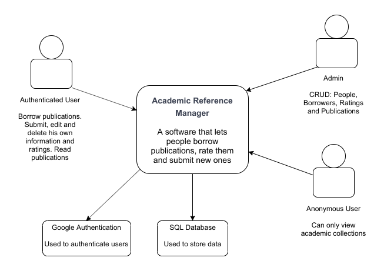
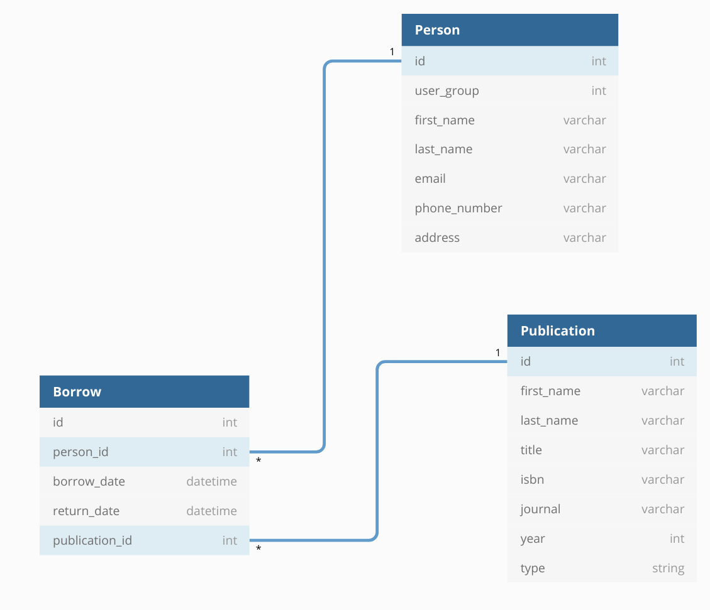

# Project 1

## Setup and Installation

### The Java Code

Since this is a prototype of the software, you are required to run the .java files manually. Trying to compile the .java
in a terminal will give compile errors due to a .jar file being used. The IDE that was required
for the course, IntelliJ is the one that should be run with the program. The .java file to execute to start the CLI
is `main.java` located in `./src/main.java`

### The YAML File for swagger.io

The YAML file is located in `./YAML/API.yaml`

To see the full GUI of the configuration, it is recommended to load it into https://editor.swagger.io

## Structure and Setup

The general structure of the program is that each item that can be place in its own category, has its own class. 
Say if we have data stored for Persons, we make a class for Persons. If we store data for a Publication, we make a 
Publication class and so on. This is done to make the different functions of the program, separate. Divide and conquer. 
All specific actions that are taken for each class are broken down to separate classes. So a Create operation for a 
specific object will be in its own class, as would a Read operation and so on. An example would be that Person has a 
ReadPerson, CreatePerson class and so on. 

Each layer is separated from one another for security, maintainability and expandability purposes.

This keeps the code clean makes it easier to go into the code later to change or fix things. It also makes it easier to add
features and functionality to the program later down the road.

### Diagrams and Schema

The diagrams and database schema are located in the `./Diagrams/` folder. The names of the diagrams are the file names for the images.

#### Context Diagram

The Context Diagram shows the three different users that will be accounted for in the software.

- Authenticated User
    - They will have the ability to borrow publications from the software and add ratings to publications that they have read
    - They will be able to edit their profile information, such as name, email and address
    - They will be able to edit or delete reviews that they have created
- Administrator
    - They will have CRUD powers for user accounts, publications and borrow records
- Anonymous User
    - They can view academic collections



#### Container Diagram

The Container diagram gives us a better idea on how the users access the software and how the data is being passed around.
There will be a web server that listens for incoming requests, these requests can be from a personal computer, smartphone, tablet, etc.
These requests are handled by the YAML configuration that was created and depending on the request, the web server will 
either read/write to a JSON format or to a SQL server. The latter will also be storing information from the Google
authentication API that will make user registration a much smother process.


#### Component Diagram

This diagram gives a better understanding on the layers that will be communicating with each other. Please not that a detailed
explanation for the Java classes is further down in the README. The Java classes take care of all data manipulation for the SQL DB
and most of the JSON formatting, although the server might pass some JSON data as well, but not as much. 
The web server will also be using the Firebase Authentication API from Google for the user authentication.
The web server is using the YAML config to process requests coming in.


#### Database Schema

The database schema consists only of tables that are used in the Java classes. The Firebase API might add some other
tables the the schema if it would be fully implemented to the system. Since a Person can only borrow a specific publication once
that means we dont need a middle table for Person and Publication. Otherwise and perhaps later down the road, we want a person
to be able to borrow the same publication many times. 



#### Top Articles Class Diagram

The implementation to `TopArticles` is pretty straight forward is would not be that difficult to add to the Java codebase.
We would have to add a new variable for Publications called averageRating which would update by itself whenever a new rating
is given to a Publication. Then we would get an array of the Top Rated Publications. But we must remember, we are only suppose
to recommend books that a user has *not* read. That is where the `filterForUser()` function comes in. That function will
get an array of all the publications that the user has read, compare them to the Top Rated Publications and remove any 
publications from that list that the user has already read.


## Class Structure

## Person [Folder]

### Person.java

- Stores all information needed for the Person data
- Functions in the class:
```java
public Person(int id, String firstName, String lastName, String email, String phoneNumber, String address)
public Person(String firstName, String lastName, String email, String phoneNumber, String address)
GETTERS
SETTERS
public String toString()
```
- This class is used to store data related to the user that is being processed in the system by the program. The usage 
of this class is quite extensive in the program, since the data related to Person touches many parts of the program.


### PersonFactory.java 

- Loads all properties needed for the Person classes
- Functions in the class:
```java
public class PersonFactory extends AbstractFactory
```
- Is not a functional class, but was added rather as an placeholder for when an expansion of the program
will take place, having its basic structure will save time.

### CreatePerson.java

- Creates a new JSON object of a person and saves it to the JSON file
- Functions in the class:
```java
public CreatePerson() 
public void AddPerson(Person person) 
public int GetCurrentId() 
```
- This class was made before the TA pointed out to me that I did NOT have to write a new JSON file with the changes,
I also somehow missed that part in the project description, although it is state quite clearly that we didn't have to.
But what this class does is to first read from the JSON file, place that content into an JSONArray. Then the filled out
Person class is created as a JSON Object and added to the JSON Array. Then a file writer writes the new JSON Array and
saves it locally on the machine.

### PersonService.java

- Gets custom settings needed for Person classes
- This is not being used in the code, but rather a implementation to make it easier to implement
factory classes in the future
- Function in the class:
```java
public void setFilePath(String filePath)
```

### ReadPerson.java

- Reads the JSON file of People and returns it
- Functions in the class:
```java
public ReadPerson()
public JSONArray getJSONArray()
public JSONObject getJSONObjectByIndex(int index)
```
- This class reads the JSON file and returns the contents in JSON- Array or Object format

### PersonTest.java

- Testing the People Class
- This was a class where all the tests for Person are, these test are not meant as pass/failed tests.

### AbstractCreatePerson.java

- A function made for a factory implementation

## Publication [Folder]

### Publication.java

- Stores information needed for Publication data
- Functions in the class:
```java
public Publication(String firstName, String lastName, String publicationTitle, String ISBN, String journal, int year, String type)
GETTERS
SETTERS
public String toString()
```

### ListPublications

- Filter and list Publications that meet the selected date criteria
- Functions in the class:
```java
public JSONArray findPublicationsByDate(Date lookupDate)
public DatesBorrow getDatesFromJSONObject(int index, String objectName)
private boolean IsBorrowedOnDate(DatesBorrow borrowDate)
private boolean IsReturnedOnDate(DatesBorrow returnDate)
GETTERS
SETTERS
public String formatDate(Date date)
public StringBuilder PublicationToStringBuilder()
public StringBuilder PersonToStringBuilder() 
```
- This function has a lot going on for itself. It does more than just List Publications, it also filters and processes
data coming into it. The latter should be moved to another class if there is refactoring to be done

### ReadPublication 

- Reads the JSON file for Publications and returns it
- Functions in the class:
```java
public ReadPublication()
public JSONArray getJSONArray()
public JSONObject getJSONObjectByIndex(int index)
```
- This class reads the JSON file and returns the contents in JSON- Array or Object format

### CreatePublication.java

- Creates a new Publication that is written to the JSON file
- Functions in the class:
```java
public void AddPublication(Publication publication) 
public int getCurrentId() 
```
- This class was made before the TA pointed out to me that I did NOT have to write a new JSON file with the changes,
  I also somehow missed that part in the project description, although it is state quite clearly that we didn't have to.
  But what this class does is to first read from the JSON file, place that content into an JSONArray. Then the filled out
  Person class is created as a JSON Object and added to the JSON Array. Then a file writer writes the new JSON Array and
  saves it locally on the machine.

## Borrow [Folder]

### Borrow.java
  
  - Stores information needed for Borrow
  - Functions in the class:
```java
public Borrow(int personID, String personName, Date borrowDate, Date returnDate, int publicationID, String publicationName)
GETTERS
SETTERS
public String formatDate(Date date)
public String toString() 
```

### CreateBorrow.java

- Creates a new Borrow that is written in a JSON file
- Functions in the class:
```java
public void createBorrow(Borrow borrow)
private boolean IsValidPublicationId(int id) 
private boolean IsValidPersonId(int id) 
private int getCurrentId()
```
- CreatesBorrow creates a Borrow instance and saves it in JSON format. There is a check for valid IDs from Person and Publication,
although the check does not compare the incoming ID with all current ones, it only checks if its higher than the current
highest ID, and if its more than 0. This could cause problems if a Borrow entry was deleted, and the freed up ID would fail that check,

### ReadBorrow.java

- Reads the JSON file for Publications and returns it
- Functions in the class:
```java
public ReadBorrow()
public JSONArray getJSONArray()
public JSONObject getJSONObjectByIndex(int index)
```
- This class reads the JSON file and returns the contents in JSON- Array or Object format

### DatesBorrow.java

- A class to store the dates in numeric format when they are being read from the JSON file

## UI [Folder]

### MainMenu.java

- This class handles all the command line interface and logic
- Functions in the class:
```java
public void DisplayMenu()
private void HomeLayout()
private void DisplayPeopleRegistryMenu()
private void DisplayPublicationRegistryMenu()
private void DisplayBorrowingMenu()
private void DisplayListOfPublicationByDateMenu()
private void DisplayListOfBorrowersByDateMenu()
private void DisplayListOfPeopleBorrowingForMoreThanMonth()
private String ReadInputString()
private int ReadInputInteger()
private GregorianCalendar ReadInputDate()
```
- This class has all the menus that the CLI uses. This should be broken down to smaller classes of refactoring
takes place. And there is sometimes a lot of logic being done for a CLI class, should also be separated from this class.

## json [Folder]

- Stores all JSON files for the program
